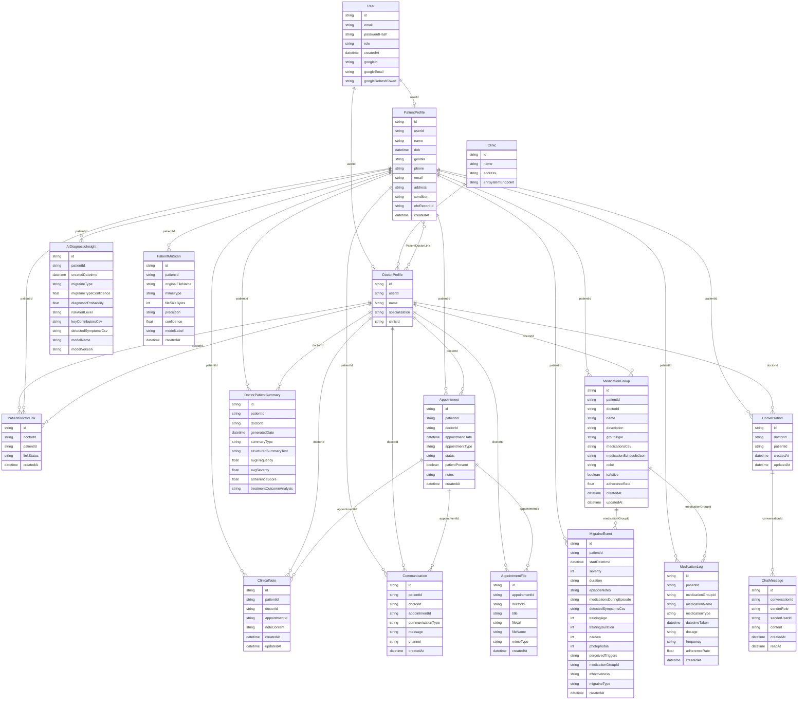

# Entity–Relationship diagram (from `prisma/schema.prisma`)

This document mirrors the **Prisma / MongoDB** schema. Notation: **crow’s foot** (Mermaid `erDiagram`), suitable for GitHub, VS Code, and export to PNG via [Mermaid Live](https://mermaid.live).

**Compared to a classic Chen diagram (your reference):**

| Reference image | This codebase |
|-----------------|---------------|
| `Patient` | `PatientProfile` (1:1 with `User` when role is PATIENT) |
| `Doctor` | `DoctorProfile` (1:1 with `User` when role is DOCTOR) + `Clinic` |
| `SymptomLog` + 1:1 `Migraine_event` | **Single** `MigraineEvent` (symptom dimensions + `detectedSymptoms` on the same row) |
| `Lifestyle_log` | **Not** a separate table (could be added later) |
| `Environment_data` | **Not** a separate table (`PatientMriScan` covers device-uploaded context; weather etc. not modeled) |
| Patient ↔ Doctor M:N | `PatientDoctorLink` (explicit junction) |

---

## Full ER diagram (Mermaid)

---

## Enum reference (not shown as entities)

- `Role`: ADMIN, PATIENT, DOCTOR  
- `LinkStatus`: PENDING, ACTIVE, REVOKED  
- `MedicationType`: PREVENTIVE, RESCUE  
- `SummaryType`: WEEKLY, MONTHLY  
- `RiskAlertLevel`: NONE, MEDIUM, HIGH  
- `AppointmentStatus`: SCHEDULED, COMPLETED, CANCELLED  
- `MedicationEffectiveness`: LOW, MODERATE, HIGH  
- `ChatSenderRole`: DOCTOR, PATIENT  
- `MigraineTypeClassification`: (see schema)

---

## Open in Draw.io (Chen-style subset)

For a diagram closer to your coursework image (entities + relationship diamonds), open:

`docs/PRISMA_ER_CHEN_OVERVIEW.drawio`

in [diagrams.net](https://app.diagrams.net/) and extend with attribute ovals as needed.
