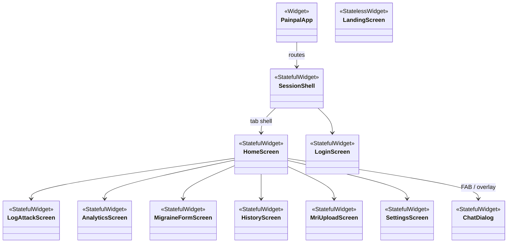
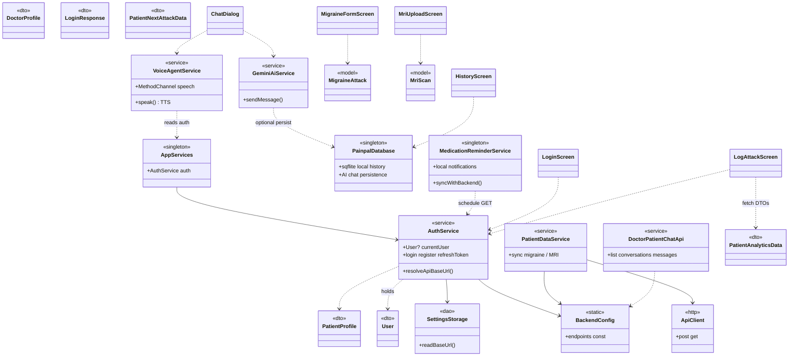
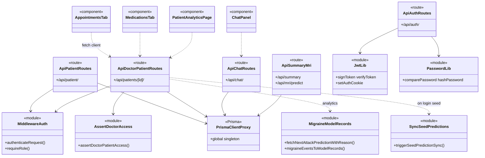
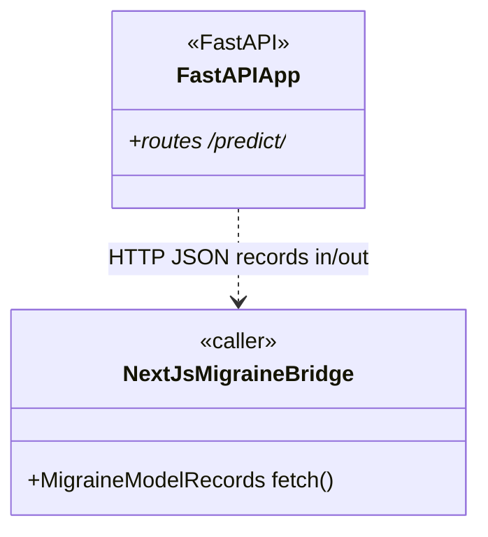

# Project-wide class / component diagram

This document describes the **FYP workspace**: the **Painpal** Flutter app (`painpal/`), the **LLM** stack (`LLM/client` Next.js + Prisma, `LLM/model` Python API), and how they connect.  
Diagrams use [Mermaid](https://mermaid.js.org/) `classDiagram` notation (UML-like). TypeScript “classes” are mostly **modules** and **React components**—shown as `<<component>>` / `<<module>>` where there is no `class` keyword.

**Repos**

| Path | Role |
|------|------|
| `painpal/lib/**` | Flutter UI, services, local DB, API DTOs |
| `LLM/client/**` | Next.js 16 App Router, REST `/api/*`, Prisma |
| `LLM/model/**` | FastAPI migraine/MRI inference (optional; `MODEL_API_URL`) |

---

## 1. System context (applications and backends)

```mermaid
classDiagram
  direction LR
  class PainpalFlutter <<Flutter app>> {
    +main()
    +HTTP to Next.js
  }
  class NextJsServer <<Next.js>> {
    +App Router
    +Route Handlers /api/*
  }
  class PrismaORM <<Prisma>> {
    +PrismaClient
  }
  class MongoDB <<database>>
  class PythonModelAPI <<FastAPI>> {
    +model/main.py
    +predict endpoints
  }
  class GoogleGemini <<external>> {
    +from mobile .env
  }

  PainpalFlutter --> NextJsServer : REST + Bearer JWT
  NextJsServer --> PrismaORM
  PrismaORM --> MongoDB
  NextJsServer ..> PythonModelAPI : MODEL_API_URL (optional)
  PainpalFlutter ..> GoogleGemini : Gemini SDK (AI chat)
```

---

## 2. Painpal (Flutter) — presentation & shell



---

## 3. Painpal (Flutter) — services, persistence, API models



> **Note:** `lib/data/patient_remote_api.dart` and `patient_analytics_api.dart` expose **top-level functions** (not classes)—they sit alongside `PatientAnalyticsData` and call `BackendConfig` + `http`.

---

## 4. LLM/client (Next.js) — boundary, auth, doctor/patient features

React files are **components** (functions), not ES6 classes—shown as `<<route>>` / `<<component>>`.



---

## 5. Prisma domain (MongoDB document models)

Maps 1:1 to `LLM/client/prisma/schema.prisma` **model** blocks (ORM entities, not Dart/TS classes).

```mermaid
classDiagram
  direction LR
  class User
  class PatientProfile
  class DoctorProfile
  class Clinic
  class PatientDoctorLink
  class MigraineEvent
  class MedicationLog
  class MedicationGroup
  class AIDiagnosticInsight
  class DoctorPatientSummary
  class Appointment
  class AppointmentFile
  class ClinicalNote
  class Communication
  class Conversation
  class ChatMessage
  class PatientMriScan

  User ||--o| PatientProfile
  User ||--o| DoctorProfile
  DoctorProfile }o--|| Clinic
  PatientProfile ||--o{ PatientDoctorLink
  DoctorProfile ||--o{ PatientDoctorLink
  PatientProfile ||--o{ MigraineEvent
  PatientProfile ||--o{ MedicationLog
  PatientProfile ||--o{ MedicationGroup
  PatientProfile ||--o{ AIDiagnosticInsight
  PatientProfile ||--o{ DoctorPatientSummary
  PatientProfile ||--o{ Appointment
  PatientProfile ||--o{ ClinicalNote
  PatientProfile ||--o{ Communication
  PatientProfile ||--o{ Conversation
  PatientProfile ||--o{ PatientMriScan
  DoctorProfile ||--o{ DoctorPatientSummary
  DoctorProfile ||--o{ Appointment
  DoctorProfile ||--o{ MedicationGroup
  DoctorProfile ||--o{ ClinicalNote
  DoctorProfile ||--o{ Communication
  DoctorProfile ||--o{ Conversation
  DoctorProfile ||--o{ AppointmentFile
  Appointment ||--o{ AppointmentFile
  Appointment ||--o{ ClinicalNote
  Appointment ||--o{ Communication
  MedicationGroup ||--o{ MigraineEvent
  MedicationGroup ||--o{ MedicationLog
  Conversation ||--o{ ChatMessage
```

---

## 6. LLM/model (Python) — high level

Training scripts are procedural; the **serving** surface is mainly **`model/main.py`** (FastAPI).



---

## 7. How to render / export

1. Paste any section’s ` ```mermaid ` block into [Mermaid Live Editor](https://mermaid.live) → **PNG/SVG**.
2. VS Code: Markdown preview with Mermaid support, or **Markdown Preview Mermaid Support** extension.
3. For a **single UML file** in StarUML / PlantUML: translate these groups manually, or use `mermaid-cli` (`mmdc`) in CI to emit SVG into `LLM/docs/diagrams/`.

---

## 8. Files ↔ diagram (quick index)

| Area | Representative paths |
|------|------------------------|
| Flutter entry | `painpal/lib/main.dart` |
| Flutter services | `painpal/lib/services/*.dart`, `painpal/lib/data/auth_service.dart` |
| Flutter UI | `painpal/lib/screens/*.dart`, `painpal/lib/widgets/*.dart` |
| Next API | `LLM/client/app/api/**/route.ts` |
| Shared TS lib | `LLM/client/lib/**/*.ts` |
| Prisma | `LLM/client/prisma/schema.prisma`, `LLM/client/lib/prisma.ts` |
| Python API | `LLM/model/main.py`, `LLM/model/text/*.py`, `LLM/model/image/*.py` |

If you want this committed as **`.drawio`** UML class shapes instead of Mermaid, say so and we can add a second artifact.
